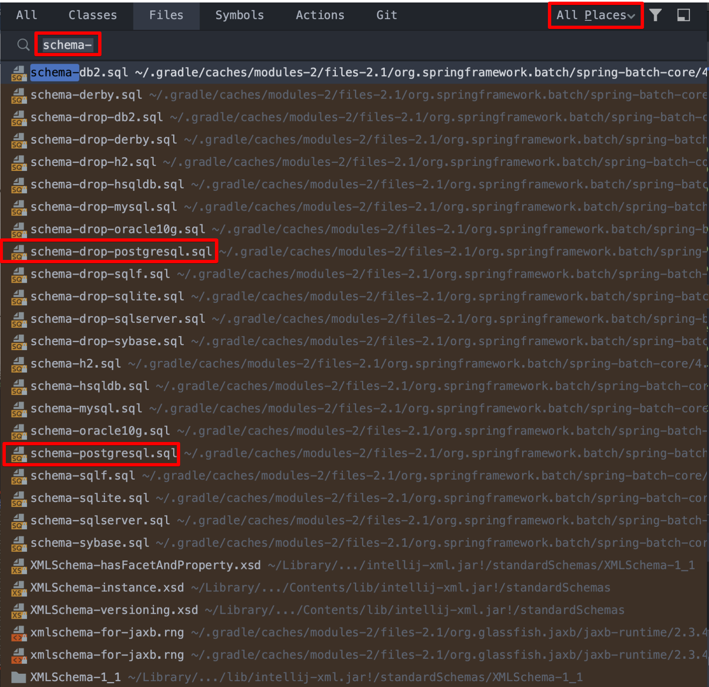
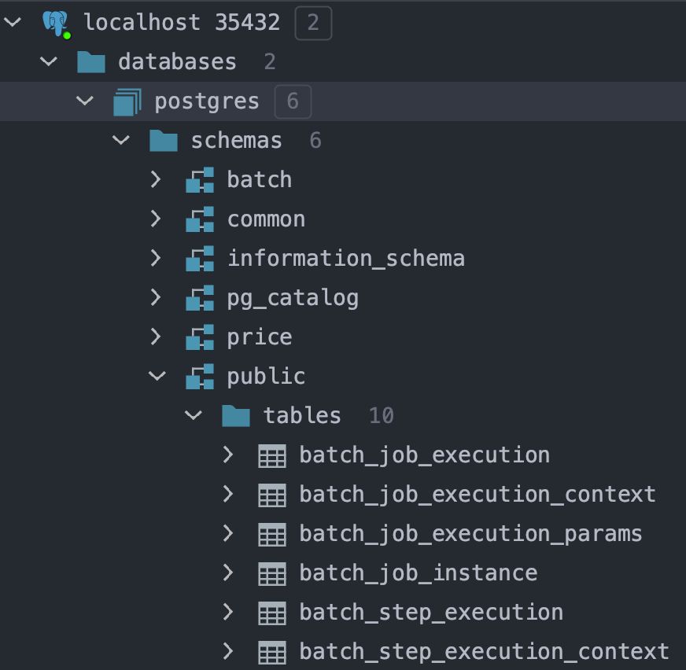

# Batch Start (1) Spring Batch 환경설정

[개발자 이동욱님, 2.Spring Batch 가이드 - Batch Job 실행해보기](https://jojoldu.tistory.com/325?category=902551) 의 글을 읽고, 나중에 다시 보기 쉽게 요약해두는 용도로 정리를 시작<br>


## 참고자료

[개발자 이동욱님, 2.Spring Batch 가이드 - Batch Job 실행해보기](https://jojoldu.tistory.com/325?category=902551)<br>

  

## 데이터베이스 선택

spring batch 예제를 정리할 때 사용할 데이터베이스는 도커 컨테이너 기반으로 사용할 예정이다. 해당 내용은 내일 중으로 docker script 관련된 내용을 추가하게 될 것 같다.<br>

예전에 잠깐 도커 컴포즈 파일을 만들고 별 오두방정을 떨었던 적이 있었는데, 다 부질없다. 도커 기반으로 테스트 환경 구축 중이라면, docker container 를 구동하는 쉘스크립트를 잘 갖춰놓으면 그거 하나만 사용하면 되는 것 같다. 내 경우는 도커 스크립트를 미리 만들어놓고 있기 때문에 그것을 수동으로 구동시킬 예정이다.<br>

추후 flyway 로 마이그레이션 하고 이런 것들을 docker 기반 로컬 DB로 마이그레이션 하는 gradle 빌드 태스크로 정의하면 좋을 듯 하다.<br>

**도커 컨테이너 기반 테스트 DB를 세팅하게 된 이유**<br>

최근 Batch Insert 하는 구문을 JDBC Template 으로 작성했는데, 컬럼들이 꽤 많아서 복잡했었다. 이때 docker 기반의 로컬 postgresql 을 생성 후에 스키마를 생성하고, 테스트 용도 애플리케이션 프로필을 추가해서 Batch Insert 구문의 정합성을 테스트했다.<br>

이렇게 하니, 30분 만에 에러를 찾아낼 수 있었다. 한번 세팅하는게 힘들지, 세팅하고 나면 데이터 정합성에 맞게끔 데이터를 넣는 것을 테스트 하는 것의 장점을 맛볼 수 있다. dev 페이스의 데이터베이스에는 다른 개발자 분들이 입력한 데이터도 있기에 정합성 테스트를 하기에는 가끔 무리가 있기도 하기에 로컬 DB 환경을 구축하는 것은 그만한 장점이 있는 것 같다.<br>

**Flyway**<br>

이렇게 구축한 docker 컨테이너에 flyway로 마이그레이션 하는 예제도 정리해볼 예정이다.<br>

<br>

## 의존성 추가

gradle 의존성

- `spring-boot-starter-batch`

- - implementation 'org.springframework.boot:spring-boot-starter-batch'

- `spring-batch-test`

- - testImplementation 'org.springframework.batch:spring-batch-test'

<br>

**build.gradle**<br>

```groovy
dependencies {
    implementation 'org.springframework.boot:spring-boot-starter-batch'
    implementation 'org.springframework.boot:spring-boot-starter-data-jdbc'
    implementation 'org.springframework.boot:spring-boot-starter-data-jpa'
    
    compileOnly 'org.projectlombok:lombok'
    runtimeOnly 'com.h2database:h2'
    runtimeOnly 'org.postgresql:postgresql'
    
    annotationProcessor 'org.projectlombok:lombok'
    testImplementation 'org.springframework.boot:spring-boot-starter-test'
    testImplementation 'org.springframework.batch:spring-batch-test'
}
```

<br>

h2 에서 테스트하는 것이 아니라면, Database 를 생성해야 한다. 스키마 및 테이블들을 생성하는 sql 들은 spring-boot-starter-batch 를 의존성으로 추가하는 순간 클래스 패스 안에 다운로드 받아진다. <br>


## 스키마 생성

시프트 두번 클릭 > 파일 검색 > 'schema-' 검색<br>

아래와 같이 파일들이 보이는데, 내 경우는 postgresql 을 사용하기에 postgresql 에 관련된 sql 파일들을 선택했다.<br>




위에서 찾은 두 파일들은 아래와 같다.<br>

- schema-postgresql.sql
- schema-drop-postgresql.sql

위의 sql 파일 중 schema-postgresql.sql 파일 내의 내용을 실행해주어야 하는데, postgresql의 경우 반드시 public 스키마 내에서 실행시켜야 한다. 그렇지 않으면 에러를 낸다. (커스터마이징 하는 법은 아직 모른다. schema를 직접 지정하는 방법에 대해 찾아봐야 할 것 같다.)<br>

**베치 메타 테이블들을 생성한 결과**<br>



<br>

## application.yml

```yaml
spring:
  profiles:
    active: test-postgresql
---
spring:
  config:
    activate:
      on-profile: test-postgresql
  datasource:
    url: jdbc:postgresql://localhost:35432/postgres
    username: postgres
    password: 1111
    driver-class-name: org.postgresql.Driver
  jpa:
    hibernate:
      ddl-auto: create
    properties:
      hibernate:
        show_sql: true
        format_sql: true
        use_sql_comments: true
    database-platform: org.hibernate.dialect.PostgreSQLDialect
```

<br>

## 샘플 코드

**SampleJobConfig.java**

```java
package io.study.jpa.key_combination.config;

import org.springframework.batch.core.Job;
import org.springframework.batch.core.Step;
import org.springframework.batch.core.configuration.annotation.JobBuilderFactory;
import org.springframework.batch.core.configuration.annotation.StepBuilderFactory;
import org.springframework.batch.repeat.RepeatStatus;
import org.springframework.context.annotation.Bean;
import org.springframework.context.annotation.Configuration;

import lombok.RequiredArgsConstructor;
import lombok.extern.slf4j.Slf4j;

@Slf4j
@RequiredArgsConstructor
@Configuration
public class SampleJobConfig {

   private final JobBuilderFactory jobBuilderFactory;
   private final StepBuilderFactory stepBuilderFactory;

   @Bean
   public Job sampleJob(){
      return jobBuilderFactory.get("sampleJob")
         .start(sampleStep())
         .build();
   }

   @Bean
   public Step sampleStep() {
      return stepBuilderFactory.get("sampleStep1")
         .tasklet((contribution, chunkContext) -> {
            log.info(">>>>> step1 ");
            return RepeatStatus.FINISHED;
         })
         .build();
   }
}
```

<br>

## Batch 설정 Enable

`@EnableBatchProcessing` 애노테이션을 붙여주자.

```java
package io.study.batch.startbatchconf1;

import org.springframework.batch.core.configuration.annotation.EnableBatchProcessing;
import org.springframework.boot.SpringApplication;
import org.springframework.boot.autoconfigure.SpringBootApplication;

@EnableBatchProcessing
@SpringBootApplication
public class StartBatchConf1Application {

	public static void main(String[] args) {
		SpringApplication.run(StartBatchConf1Application.class, args);
	}

}
```

