# Batch Start (2) 메타테이블과 Job 과의 관계

[개발자 이동욱님, 3. Spring Batch 가이드 - 메타테이블 엿보기](https://jojoldu.tistory.com/326?category=902551) 의 내용을 요약함. 최대한 짧게 무한 반복으로 볼수 있게 액기스만~!!<br>


## 참고자료

[개발자 이동욱님, 3. Spring Batch 가이드 - 메타테이블 엿보기](https://jojoldu.tistory.com/326?category=902551)<br>


## Overview

Spring Batch가 작업 기록을 저장하는 테이블들은 여러가지가 있다. 이 테이블 들 중에서 `BATCH_JOB_INSTANCE` , `BATCH_JOB_EXECUTION` , `BATCH_JOB_EXECUTION_PARAMS` 

테이블의 주요 컬럼 및 Batch Job 의 실행/성공/파라미터와 어떤 관계를 가지는지 정리해볼 예정이다.<br>

- BATCH_JOB_INSTANCE
- BATCH_JOB_EXECUTION
- BATCH_JOB_EXECUTION_PARAMS

<br>

**Job, Job Instance, Job Execution, Job Execution Params**<br>

Spring Batch에서 주요하게 다뤄지는 개념인 Job, Job Instance, Job Execution, Job Execution Params 와 Batch Job, Step 의 실행/실패가 주요 테이블들과 어떤 관계를 가지는지 그림을 그려봤다.<br>

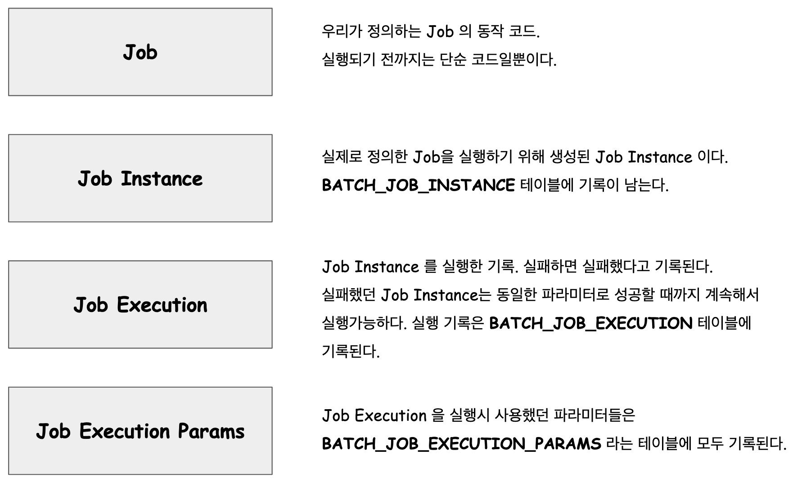

<br>

**파라미터 입력 시 주의사항**<br>

batch의 파라미터로 확인 가능한 파라미터의 이름은 jobParameters 이다. jobParameter 라고 입력해놓고 에러가 났는데 어디서 에러가 났는지 체크를 못해서 굉장히 애를 먹었었다.<br>

<br>

## BATCH_JOB_INSTANCE

BATCH_JOB_INSTANCE 가 생성되었던 이력이 남는 테이블이다. BATCH_JOB_INSTANCE는 유일하게 식별되는 JOB PARAMETER로 실행될 경우에만 새로 생성된다.<br>

즉, Job Parameter가 실행시마다 이전 작업의 Job Parameter와 다른 파라미터여야만 Job Instance가 새로 생성된다. 그렇지 않으면 에러는 내지 않으며, JOB_INSTANCE 에도 기록되지 않고 skip 하고 지나간다.<br>

BATCH_JOB_INSTANCE 테이블의 내용을 조회해보면 아래와 같다.<br>

```sql
select * from batch_job_instance;
```

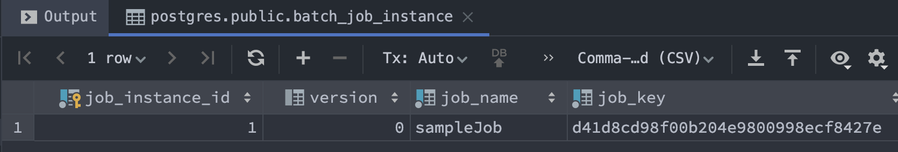


### Batch Job Instance 테스트해보기

BATCH 로 JOB 을 실행시, 예전에 사용했던 파라미터가 아닌 새로운 파라미터로 Batch Job을 실행하면 BATCH_JOB_INSTANCE 에 JOB 이 실행된 기록이 남는다. JOB이 이미 실행되었다면 이미 실행되었던 JOB이기에 실행하지 않는다는 로그가 남는다.<br>

이번에는 Job Parameter 를 지정해서 수행했을 때 BATCH_JOB_INSTANCE 테이블에 실제로 row 가 하나 더 추가되는지, 로그에는 어떻게 남는지 확인해보자.<br>

주의할 점은 이번에 사용하는 코드에서는 Step에 @JobScope 라는 어노테이션을 추가해주어야 한다.<br>

또한 프로그램의 Argument 를 JobParameter 로 입력해주어야 한다. 지금은 일단 Intellij 에서 JobParameter를 입력하는 방법을 정리해둘 예정이다.<br>

```java
package io.study.batch.startbatchconf1.config;
// ...
import org.springframework.beans.factory.annotation.Value;
// ... 

@Slf4j
@RequiredArgsConstructor
@Configuration
public class SampleJobConfig {

	private final JobBuilderFactory jobBuilderFactory;
	private final StepBuilderFactory stepBuilderFactory;

	@Bean
	public Job sampleJob(){
		return jobBuilderFactory.get("sampleJob")
			.start(sampleStep1(null))
			.build();
	}

	@Bean
	@JobScope
	public Step sampleStep1(@Value("#{jobParameters[startDate]}") String startDate) {
		return stepBuilderFactory.get("sampleStep1")
			.tasklet((contribution, chunkContext) -> {
				log.info(" >> [실행] sampleStep1 ");
				log.info(" >> startDate = {} ", startDate);
				return RepeatStatus.FINISHED;
			})
			.build();
	}
}
```

**Batch 실행시켜보기**<br>

Batch 는 주로 파라미터로 방금 실행시킨 Job이 이전에 실행했던 Job을 한 번 더 실행하는 것인지 여부를 파라미터와 Job Id로 체크한다. 따라서 Batch에 파라미터를 매번 다르게 전달해주어야 한다. <br>

이때 프로그램의 Argutment로 Batch에 Argument 를 전달해준다. 인텔리제이에서는 Run > Edit Configuration 에서 Program Argument 로 Job Parameter 를 전달해주면 된다.<br>

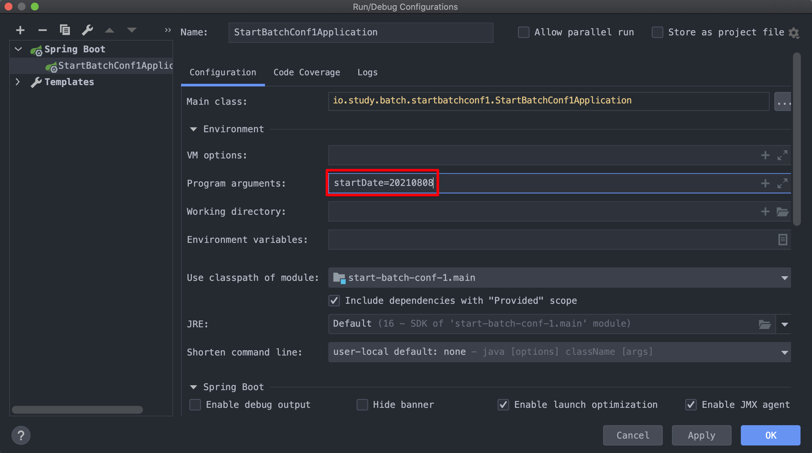

파라미터 명은 startDate 이고 이 파라미터에 대한 값은 20210808 으로 전달해주었다.<br>

이제 실행시켜보자. Job Parameter 를 다르게 해서 실행해보니, 아래와 같이 실행되었음을 확인가능하다.<br>

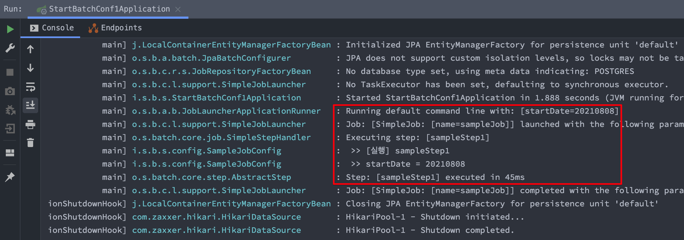

<br>

이제는 batch_job_instance 테이블의 내용을 조회해보자

```sql
select * from batch_job_instance;
```

<br>

조회해보면 아래와 같이 row 가 하나 추가되어 있는 것을 확인 가능하다.<br>

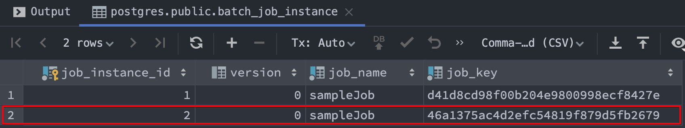

<br>

만약, 위에서 Edit Configuration 창에서 입력했던 startDate 파라미터 값을 바꾸지 않고 실행하면 아래와 같은 로그와 함께 Exception이 출력된다.

```plain
Caused by: org.springframework.batch.core.repository.JobInstanceAlreadyCompleteException: A job instance already exists and is complete for parameters={startDate=20210808}.  If you want to run this job again, change the parameters.
	at org.springframework.batch.core.repository.support.SimpleJobRepository.createJobExecution(SimpleJobRepository.java:139) ~[spring-batch-core-4.3.3.jar:4.3.3]
	at java.base/jdk.internal.reflect.NativeMethodAccessorImpl.invoke0(Native Method) ~[na:na]
	at java.base/jdk.internal.reflect.NativeMethodAccessorImpl.invoke(NativeMethodAccessorImpl.java:78) ~[na:na]
	at java.base/jdk.internal.reflect.DelegatingMethodAccessorImpl.invoke(DelegatingMethodAccessorImpl.java:43) ~[na:na]
	at java.base/java.lang.reflect.Method.invoke(Method.java:567) ~[na:na]
	at org.springframework.aop.support.AopUtils.invokeJoinpointUsingReflection(AopUtils.java:344) ~[spring-aop-5.3.9.jar:5.3.9]
```

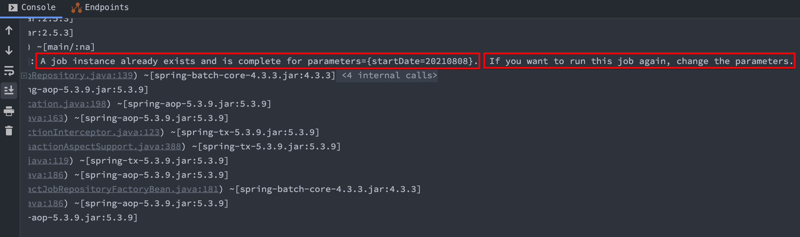

<br>

테이블을 확인해보면 같은 인스턴스로 또 실행할 경우 중복된 작업으로 생각하여 새로 추가된 instance 가 존재하지 않는 것을 확인가능하다.<br>

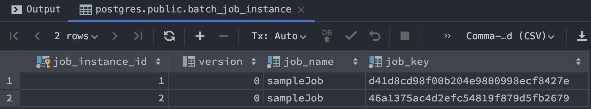

<br>

## BATCH_JOB_EXECUTION

JOB_INSTANCE 의 성공/실패 여부를 기록하는 테이블은 BATCH_JOB_EXECUTION 테이블이다.<br>

지금까지 실행한 Job 을 조회해보자.<br>

```sql
select job_execution_id, job_instance_id, status, exit_code, exit_message from batch_job_execution;
```

결과를 자세히 보면 job_instance_id 가 1인 것의 실행기록이 두개가 있는 것을 볼 수 있다.

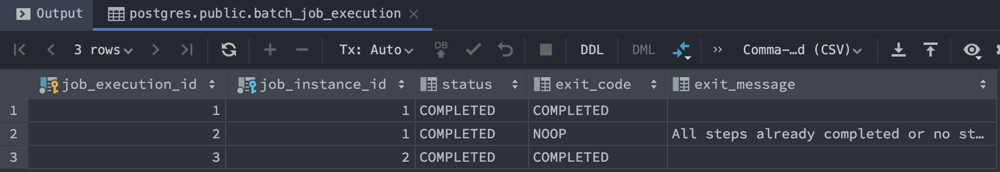

exit_message 에는 "All steps already completed or no steps configured for this job." 라고 적혀있고, exit_code = NOOP 이다.<br>

### 테스트해보기

**SampleJobConfig.java**

```java
package io.study.batch.startbatchconf1.config;

// ...

@Slf4j
@RequiredArgsConstructor
@Configuration
public class SampleJobConfig {

	private final JobBuilderFactory jobBuilderFactory;
	private final StepBuilderFactory stepBuilderFactory;

	@Bean
	public Job sampleJob(){
		return jobBuilderFactory.get("sampleJob")
			.start(sampleStep1(null))
			.next(sampleStep2(null))
			.build();
	}

	@Bean
	@JobScope
	public Step sampleStep1(@Value("#{jobParameters[startDate]}") String startDate) {
		return stepBuilderFactory.get("sampleStep1")
			.tasklet((contribution, chunkContext) -> {
				log.info(" >> [실행] sampleStep1 ");
				throw new IllegalArgumentException("sampleStep1 >> 예외를 강제로 발생시켰다.");
			})
			.build();
	}

	@Bean
	public Step sampleStep2(@Value("#{jobParameter[startDate]}") String startDate) {
		return stepBuilderFactory.get("sampleStep2")
			.tasklet((contribution, chunkContext) -> {
				log.info(">>> [실행] sampleStep2 ");
				log.info(">>> jobParameter = {}", startDate);
				return RepeatStatus.FINISHED;
			})
			.build();
	}
}
```

sampleStep1 에서 IllegalArgumentException 을 throw 하게끔 했고, 

이때 sampleStep2를 무사히 실행하는지 확인해보자.

jobParameter 를 아래와 같이 바꿔주자. startDate=20210809 로 주었다.

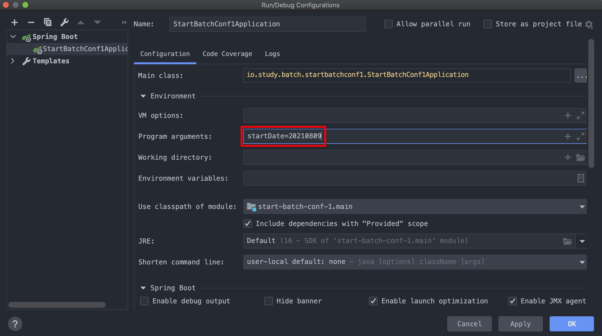

<br>

실행해보면 아래와 같은 결과가 나타난다.<br>

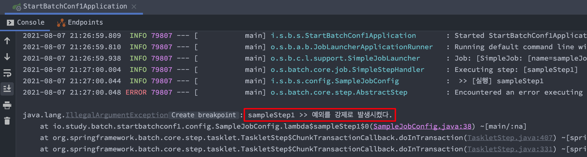

<br>

BATCH_JOB_EXECUTION 테이블에는 실패기록이 남았는지 확인해보자.

```sql
select job_execution_id, job_instance_id, status, exit_code, exit_message from batch_job_execution;
```

<br>

코드를 정상적으로 수정한 후에는 어떻게 실행되는지 확인해보자.<br>

파라미터는 바꾸지 않고 그대로 실행하자.

( 아까 입력했던 파라미터는 startDate=20210809 이다.)

**정상적으로 수정한 코드**<br>

```java
package io.study.batch.startbatchconf1.config;
// ...

@Slf4j
@RequiredArgsConstructor
@Configuration
public class SampleJobConfig {

	private final JobBuilderFactory jobBuilderFactory;
	private final StepBuilderFactory stepBuilderFactory;

	@Bean
	public Job sampleJob(){
		return jobBuilderFactory.get("sampleJob")
			.start(sampleStep1(null))
			.next(sampleStep2(null))
			.build();
	}

	@Bean
	@JobScope
	public Step sampleStep1(@Value("#{jobParameters[startDate]}") String startDate) {
		return stepBuilderFactory.get("sampleStep1")
			.tasklet((contribution, chunkContext) -> {
				log.info(" >> [실행] sampleStep1 ");
				log.info(">>> jobParameter = {}", startDate);
				return RepeatStatus.FINISHED;
			})
			.build();
	}

	@Bean
	@JobScope
	public Step sampleStep2(@Value("#{jobParameters[startDate]}") String startDate) {
		return stepBuilderFactory.get("sampleStep2")
			.tasklet((contribution, chunkContext) -> {
				log.info(">>> [실행] sampleStep2 ");
				log.info(">>> jobParameter = {}", startDate);
				return RepeatStatus.FINISHED;
			})
			.build();
	}
}
```

<br>

정상적으로 실행되었다는 것을 확인했다.

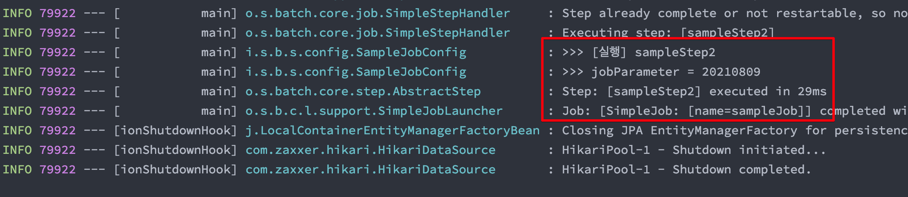

<br>

테이블을 확인해보자.

정상적으로 수행되었음을 확인 가능하다.

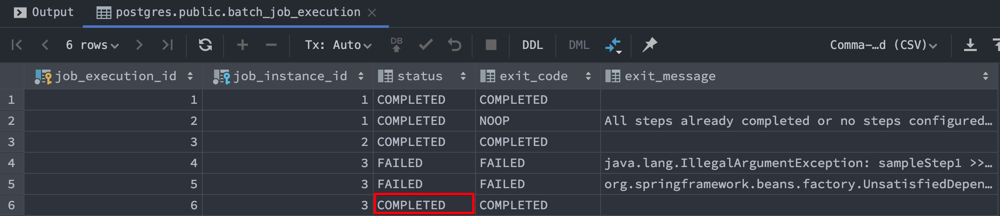

(사실 step2에 jobParameters 라는 파라미터를 잘못 입력해서 실행을 두번 했었다 즉, step1을 성공했지만 step2 실행이 한번 더 실패햇었다.)<br>


## BATCH_JOB_EXECUTION_PARAMS

BATCH_JOB_EXECUTION_PARAMS 테이블을 조회해보면 Batch 를 실행할때 입력했었던 파라미터 들을 확인할 수 있다.

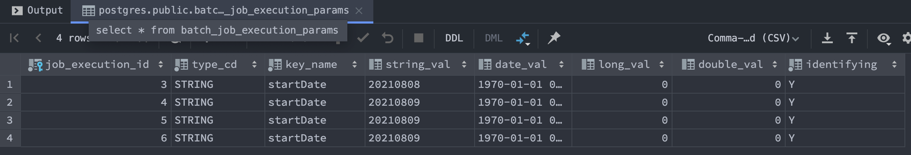

<br>