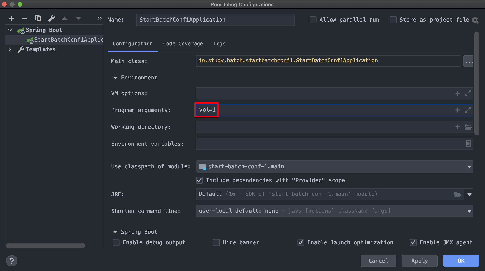
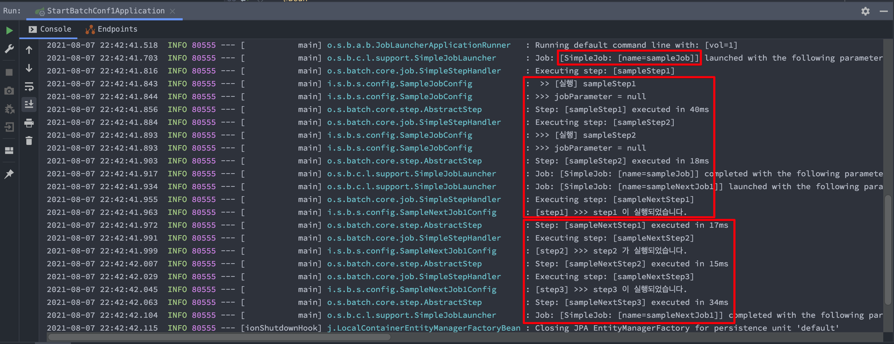
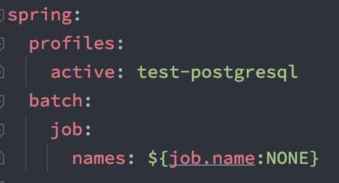
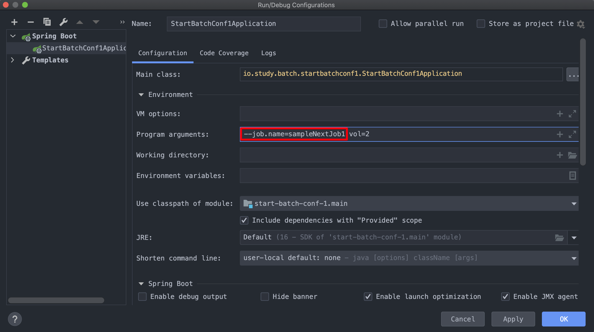
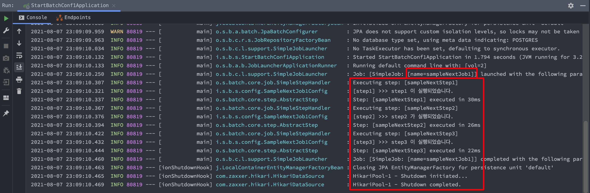

# Batch Start (3) 특정 Job만 선택해서 실행되도록 하기 (Job 파라미터 전달하기)

[개발자 이동욱님, 4. Spring Batch 가이드 - Spring Batch Job Flow](https://jojoldu.tistory.com/326?category=902551) 의 내용을 요약함. 최대한 짧게 무한 반복으로 볼수 있게 액기스만~!!<br>


## 참고자료

[개발자 이동욱님, 4. Spring Batch 가이드 - Spring Batch Job Flow](https://jojoldu.tistory.com/326?category=902551)<br>


## 실행할 Job을 지정하지 않고 모든 Job 을 실행시켜보기

실행하는 코드는 아래와 같다. step1(), step2(), step3() 를 차례로 실행시키는 코드이다. 파라미터는 vol=1 로 주어서 실행해 볼 예정이다. 결론만 말하자면, 이전 코드에서 sampleJob 이라는 배치를 만들었기 때문에 아래 코드의 Job 말고도 sampleJob 도 함께 실행된다.


**예제코드**<br>

**SampleNextJob1Config.java**

```java
package io.study.batch.startbatchconf1.config;

// ...

@Slf4j
@RequiredArgsConstructor
@Configuration
public class SampleNextJob1Config {

	private final JobBuilderFactory jobBuilderFactory;
	private final StepBuilderFactory stepBuilderFactory;

	@Bean
	public Job sampleNextJob1(){
		return jobBuilderFactory.get("sampleNextJob1")
			.start(sampleNextStep1())
			.next(sampleNextStep2())
			.next(sampleNextStep3())
			.build();

	}

	@Bean
	@JobScope
	public Step sampleNextStep1() {
		return stepBuilderFactory.get("sampleNextStep1")
			.tasklet((contribution, chunkContext) -> {
				log.info("[step1] >>> step1 이 실행되었습니다.");
				return RepeatStatus.FINISHED;
			})
			.build();
	}

	@Bean
	@JobScope
	public Step sampleNextStep2() {
		return stepBuilderFactory.get("sampleNextStep2")
			.tasklet((contribution, chunkContext) -> {
				log.info("[step2] >>> step2 가 실행되었습니다.");
				return RepeatStatus.FINISHED;
			})
			.build();
	}

	@Bean
	@JobScope
	public Step sampleNextStep3() {
		return stepBuilderFactory.get("sampleNextStep3")
			.tasklet((contribution, chunkContext) -> {
				log.info("[step3] >>> step3 이 실행되었습니다.");
				return RepeatStatus.FINISHED;
			})
			.build();
	}

}
```


아래와 같이 configuration 에서 parameter 를 vol=1 로 지정해주었다.



결과는 아래와 같다. 이전에 작성했던 sampleJob이 sampleStep1, sampleStep2, sampleStep3 를 모두 실행시킨 것을 확인 가능하다.<br>

<br>

그리고 sampleNextStep1, sampleNextStep2, sampleNextStep3 역시도 실행되었다. 모든 Job 들이 무분별하게 모두 실행되었다.




## Job 을 선택해서 실행하기

이번에는 Job 을 선택해서 실행해보자. 이렇게 하는 경우가 어떤 경우가 있을지 예를 들어보면  Job이나, 특정 파라미터에 대한 연산을 외부에서 실행시켜야 하는 경우(정산, 회원 배치 등등)가 있지 않을까 싶다. 또는 실패한 Job을 프로그램 외부에서 실행시키는 경우도 예로 들 수 있을 것 같다.<br>

src/main/resources 밑의 application.yml 파일에 아래의 내용을 추가해주자.

```java
spring.batch.job.names: ${job.name:NONE}
```



<br>

- ${job.name:NONE}

- - job.name 이 있으면 job.name 값을 반환
  - job.name 이 없을 경우는 NONE 값을 반환

- NONE

- - spring.batch.job 에 NONE 이 지정되면 어떠한 배치도 실행되지 않는다.

<br>

이제 Intellij 에서 실행할 때에는 아래와 같이 파라미터를 지정해주면 된다. 파라미터로 `--job.name` 에 값을 지정하여 전달해주면 된다. <br>

> --job.name=sampleNextJob1 vol=2

vol 역시도 vol=1 로 한번 실행되었었기에 vol=2 를 파라미터로 해서 한번 더 실행했다.

(jar 를 실행시켜야 하는 운영환경에서는 java -jar batc-app.jar --job.name=stepNextJob1 vol=2 와 같은 명령으로 실행시켜주면 된다.)<br>



<br>

**실행결과**<br>

sampleNextJob1 만 실행되었음을 확인 가능하다.



