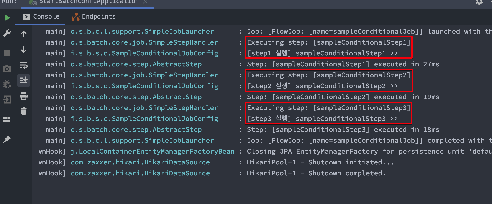

# Batch Start (4) - 조건부 Step 실행

[개발자 이동욱님, 4. Spring Batch 가이드 - Spring Batch Job Flow](https://jojoldu.tistory.com/328?category=902551) 를 보고 요약함. 예제 코드는 [여기](https://github.com/gosgjung/study-batch/blob/develop/example-codes/START-BATCH-EXAMPLES/src/main/java/io/study/batch/startbatchexamples/config/SampleConditionalJobConfig.java)에 정리해두었다.<br>

<br>

## 참고자료

[개발자 이동욱님, 4. Spring Batch 가이드 - Spring Batch Job Flow](https://jojoldu.tistory.com/328?category=902551)<br>

<br>

## OVERVIEW

Step 은 조건을 지정해서 특정 조건을 만족하는 경우에만 실행할 수 있다.


이미지 출처 : https://docs.spring.io/spring-batch/docs/current/reference/html/step.html#conditionalFlow<br>

<br>

## 예제 시나리오

코드를 바꿔가면서 아래와 같이 동작하게끔 바꿔볼 예정이다.<br>

step1 이 실패할 경우

- Step1 -> step3 

<br>

step1 이 성공했고, step2 역시도 성공했고 step3 까지 실행하는 경우

- step1 -> step2 -> step3

<br>

## 조건부 Step 실행 Job 선언 구문

```java
package io.study.batch.startbatchconf1.config;

// ...

@Slf4j
@RequiredArgsConstructor
@Configuration
public class SampleConditionalJobConfig {

	private final JobBuilderFactory jobBuilderFactory;
	private final StepBuilderFactory stepBuilderFactory;

	@Bean
	public Job sampleConditionalJob(){
		return jobBuilderFactory.get("sampleConditionalJob")
			.start(sampleConditionalStep1())	// -- (1)
				.on("FAILED") // FAILED 일 경우  
				.to(sampleConditionalStep3())	// STEP3 로 이동
				.on("*") // STEP3의 결과와는 무관하게
				.end()	// STEP3 이후에는 Flow 를 종료
			.from(sampleConditionalStep1())	// (1) 이 FAILED 가 아닐때는 여기로 온다.
				.on("*") 
				.to(sampleConditionalStep2())	// step2() 를 실행한다.
				.next(sampleConditionalStep3()) // step2의 결과와 관계 없이 강제로 step3 를 실행
      				// next 는 on 과는 다르게 아무 조건 없이 다음 동작을 수행하도록 할 때 사용한다.
				.on("*") // step3 의 결과와는 무관하게
				.end()// Flow 를 종료시킨다. (FlowBuilder)
			.end()// Job을 종료시킨다. (FlowJobBuilder)
			.build();
	}

    // ...
}
```

<br>

**TODO** 아래 메서드들은 내일 정리할 예정이다. 요즘 다른일로 많이 바빠서 ㅠㅜ

- on()
- start ~ from
  - on ("FAILED", "*", ... )
- next()
- end ()

<br>

참고) 실행시에는 위에서 Bean으로 생성한 `sampleConditionalJob` 을 인자로 받게끔 해준다. Run Configurations 창을 열어서 파라미터를 아래와 같이 입력해주자.


<br>

## Step1 -> Step3 로 실행해보기

step1 이후에 step3 를 실행하는 구문은 아래와 같이 작성했다. 필요한 부분만 발췌할까 했는데, 그냥 전체 코드를 가져왔다.<br>

```java
package io.study.batch.startbatchexamples.config;

import org.springframework.batch.core.Job;
import org.springframework.batch.core.Step;
import org.springframework.batch.core.configuration.annotation.JobBuilderFactory;
import org.springframework.batch.core.configuration.annotation.JobScope;
import org.springframework.batch.core.configuration.annotation.StepBuilderFactory;
import org.springframework.batch.repeat.RepeatStatus;
import org.springframework.context.annotation.Bean;
import org.springframework.context.annotation.Configuration;

import lombok.RequiredArgsConstructor;
import lombok.extern.slf4j.Slf4j;

@Slf4j
@RequiredArgsConstructor
@Configuration
public class SampleConditionalJobConfig {

	private final JobBuilderFactory jobBuilderFactory;
	private final StepBuilderFactory stepBuilderFactory;

	@Bean
	public Job sampleConditionalJob(){
		return jobBuilderFactory.get("sampleConditionalJob")
			.start(sampleConditionalStep1())	// -- (1)
				.on("FAILED") // FAILED 일 경우  
				.to(sampleConditionalStep3())	// STEP3 로 이동
				.on("*") // STEP3의 결과와는 무관하게
				.end()	// STEP3 이후에는 Flow 를 종료
			.from(sampleConditionalStep1())	// (1) 이 FAILED 가 아닐때는 여기로 온다.
				.on("*") 
				.to(sampleConditionalStep2())	// step2() 를 실행한다.
				.next(sampleConditionalStep3()) // step2의 결과와 관계 없이 강제로 step3 를 실행
      				// next 는 on 과는 다르게 아무 조건 없이 다음 동작을 수행하도록 할 때 사용한다.
				.on("*") // step3 의 결과와는 무관하게
				.end()// Flow 를 종료시킨다. (FlowBuilder)
			.end()// Job을 종료시킨다. (FlowJobBuilder)
			.build();
	}

	@Bean
	@JobScope
	public Step sampleConditionalStep1() {
		return stepBuilderFactory.get("sampleConditionalStep1")
			.tasklet((contribution, chunkContext) -> {
				log.info("[step1 실행] sampleConditionalStep1 >>");
				contribution.setExitStatus(ExitStatus.FAILED);
				return RepeatStatus.FINISHED;
			})
			.build();
	}

	@Bean
	@JobScope
	public Step sampleConditionalStep2() {
		return stepBuilderFactory.get("sampleConditionalStep2")
			.tasklet((contribution, chunkContext) -> {
				log.info("[step2 실행] sampleConditionalStep2 >>");
				return RepeatStatus.FINISHED;
			})
			.build();
	}

	@Bean
	@JobScope
	public Step sampleConditionalStep3() {
		return stepBuilderFactory.get("sampleConditionalStep3")
			.tasklet((contribution, chunkContext) -> {
				log.info("[step3 실행] sampleConditionalStep3 >>");
				return RepeatStatus.FINISHED;
			})
			.build();
	}
}
```

**TODO** 이 소스의 설명 역시도 내일 정리할 예정이다. 일단 주석이라도 남겨놓았다. 진짜 너무 많음. 조금...은 아니고 엄청 피곤할 정도로 바빠서 내일 중으로 정리하게 될 것같다.<br>

<br>

## Step1 -> Step2 -> Step3

이번에는 위의 소스코드의 step1 에서 에러를 내는 부분인 `contribution.setExitSTatus(ExitStatus.FAILED)` 를 주석처리해서 step1 -> step2 -> step3 로 순차 실행되도록 지정해주었다.<br>

```java
package io.study.batch.startbatchexamples.config;

import org.springframework.batch.core.Job;
import org.springframework.batch.core.Step;
import org.springframework.batch.core.configuration.annotation.JobBuilderFactory;
import org.springframework.batch.core.configuration.annotation.JobScope;
import org.springframework.batch.core.configuration.annotation.StepBuilderFactory;
import org.springframework.batch.repeat.RepeatStatus;
import org.springframework.context.annotation.Bean;
import org.springframework.context.annotation.Configuration;

import lombok.RequiredArgsConstructor;
import lombok.extern.slf4j.Slf4j;

@Slf4j
@RequiredArgsConstructor
@Configuration
public class SampleConditionalJobConfig {

	private final JobBuilderFactory jobBuilderFactory;
	private final StepBuilderFactory stepBuilderFactory;

	@Bean
	public Job sampleConditionalJob(){
		return jobBuilderFactory.get("sampleConditionalJob")
			.start(sampleConditionalStep1())	// -- (1)
				.on("FAILED") // FAILED 일 경우  
				.to(sampleConditionalStep3())	// STEP3 로 이동
				.on("*") // STEP3의 결과와는 무관하게
				.end()	// STEP3 이후에는 Flow 를 종료
			.from(sampleConditionalStep1())	// (1) 이 FAILED 가 아닐때는 여기로 온다.
				.on("*") 
				.to(sampleConditionalStep2())	// step2() 를 실행한다.
				.next(sampleConditionalStep3()) // step2의 결과와 관계 없이 강제로 step3 를 실행
      				// next 는 on 과는 다르게 아무 조건 없이 다음 동작을 수행하도록 할 때 사용한다.
				.on("*") // step3 의 결과와는 무관하게
				.end()// Flow 를 종료시킨다. (FlowBuilder)
			.end()// Job을 종료시킨다. (FlowJobBuilder)
			.build();
	}

	@Bean
	@JobScope
	public Step sampleConditionalStep1() {
		return stepBuilderFactory.get("sampleConditionalStep1")
			.tasklet((contribution, chunkContext) -> {
				log.info("[step1 실행] sampleConditionalStep1 >>");
				// contribution.setExitStatus(ExitStatus.FAILED);
				return RepeatStatus.FINISHED;
			})
			.build();
	}

	@Bean
	@JobScope
	public Step sampleConditionalStep2() {
		return stepBuilderFactory.get("sampleConditionalStep2")
			.tasklet((contribution, chunkContext) -> {
				log.info("[step2 실행] sampleConditionalStep2 >>");
				return RepeatStatus.FINISHED;
			})
			.build();
	}

	@Bean
	@JobScope
	public Step sampleConditionalStep3() {
		return stepBuilderFactory.get("sampleConditionalStep3")
			.tasklet((contribution, chunkContext) -> {
				log.info("[step3 실행] sampleConditionalStep3 >>");
				return RepeatStatus.FINISHED;
			})
			.build();
	}
}
```

**TODO** 이 소스의 설명 역시도 내일 정리할 예정이다. 일단 주석이라도 남겨놓았다. 진짜 너무 많음. 조금...은 아니고 엄청 피곤할 정도로 바빠서 내일 중으로 정리하게 될 것같다.<br>

<br>



<br>

