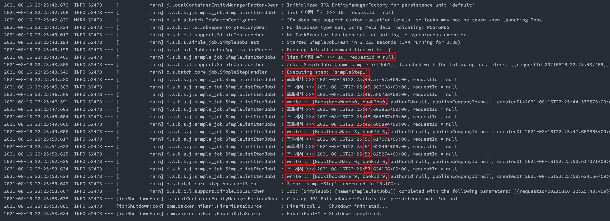

# Play Batch (1) - 단순 ListItemReader 예제 1

예제로 어떤걸 만들까? 하다가 머리 뽀개지는 줄 알았다. 자꾸 하나 정했는데, 다른 아이디어가 떠오르고 그래서 힘들었었다.<br>

오늘은 일단 예제의 소스코드와 출력결과만 정리해놓고, 아... 이번주 내로 정리할 예정이다. 요즘 공부하는거 왜 이렇게 체력이 딸리는지 모르겠다.<br>

<br>

## 예제 시나리오

나중에 정리할 예정이다. 바쁘다. 다른 일도 해야 해서.. 몸도 피곤하다아아아...<br>

<br>

## JobComponent 만들기

Job과, Step, Reader, Processor, Writer 를 @Bean 을 통해 스프링 전역에 등록하는 것은 @Configuration 으로 등록해도 되고, @Component 로 등록해도 된다. 오늘 예제에서는 @Component 로 선언해서 Bean 으로 등록했다.<br>

<br>

**SimpleListItemJob1.java**<br>

```java
@Slf4j
@RequiredArgsConstructor
@Component
public class SimpleListItemJob1 {

	private final JobBuilderFactory jobBuilderFactory;
	private final StepBuilderFactory stepBuilderFactory;

	@Bean(name="simpleListJob1")
	public Job simpleListJob1(){
		return jobBuilderFactory.get("simpleListJob1")
			.start(simpleStep1(null))
			.build();
	}

	@JobScope
	@Bean(name = "simpleStep1")
	public Step simpleStep1(@Value("#{jobParameters[requestId]}") String requestId) {
		return stepBuilderFactory.get("simpleStep1")
			.<Book, Book>chunk(3)
			.reader(simpleBookReader1(null))
			.processor(simpleBookProcessor1(null))
			.writer(simpleBookWriter1())
			.build();
	}

	@StepScope
	@Bean(name = "simpleBookReader1")
	public ListItemReader<Book> simpleBookReader1(@Value("#{jobParameters[requestId]}") String requestId){
		LinkedList<Book> bookList = new LinkedList<>();

		for(int i=0; i<10; i++){
			Book b = Book.builder()
				.bookName(String.valueOf(i))
				.bookId(Long.parseLong(String.valueOf(i)))
				.build();

			bookList.add(b);
		}
		log.info("list 아이템 추가 >>> " + bookList.size() + ", requestId = " + requestId);

		return new ListItemReader<>(bookList);
	}

	@StepScope
	@Bean(name = "simpleBookProcessor1")
	public ItemProcessor<Book, Book> simpleBookProcessor1(@Value("#{jobParameters[requestId]}") String requestId){
		return new ItemProcessor<Book, Book>() {
			@Override
			public Book process(Book item) throws Exception {
				Thread.sleep(1000L);
				OffsetDateTime nowDt = OffsetDateTime.now();
				log.info("프로세서 >>> " + nowDt + ", requestId = " + requestId);
				item.setCreatedDt(nowDt);
				return item;
			}
		};
	}

	@StepScope
	@Bean(name = "simpleBookWriter1")
	public ItemWriter<Book> simpleBookWriter1(){
		return new ItemWriter<Book>() {
			@Override
			public void write(List<? extends Book> items) throws Exception {
				log.info("write :: " + items);
			}
		};
	}

}
```

<br>

## 테스트 코드

이렇게 작성한 소스를 실행시키려면, 인텔리제이의 Run Configuration 을 바꿔서 해도 되지만, 테스트 코드에서 프로그램 내에서 동적으로 Job 을 생성되도록 하는 테스트 코드를 작성했다.

```java
@SpringBootTest
public class SimpleJob1Test {

	@Autowired
	private JobLauncher jobLauncher;

	@Autowired
	private SimpleListItemJob1 jobConfig1;

	DateTimeFormatter formatter = DateTimeFormatter.ofPattern("yyyyMMdd HH:mm:ss.SSS");

	@Test
	@DisplayName("잡런처_실행해볼까")
	public void 잡런처_실행해볼까(){
		final JobParameters jobParameters = new JobParametersBuilder()
			.addString("requestId", OffsetDateTime.now().format(formatter))
			.toJobParameters();

		try {
			jobLauncher.run(jobConfig1.simpleListJob1(), jobParameters);
		} catch (
			JobExecutionAlreadyRunningException | JobRestartException |
			JobInstanceAlreadyCompleteException | JobParametersInvalidException e
		) {
			e.printStackTrace();
		}
	}
}
```

<br>

## 출력결과

로그를 자세히 보면, size = 10 인 리스트를 chunk size 인 3 만큼 읽어들이고 있다.



<br>

해당 로그의 텍스트는 아래에 남겨두었다.

```plain
2021-08-16 22:25:43.409  INFO 52473 --- [           main] i.s.b.s.j.simple_job.SimpleListItemJob1  : list 아이템 추가 >>> 10, requestId = null
2021-08-16 22:25:43.506  INFO 52473 --- [           main] o.s.b.c.l.support.SimpleJobLauncher      : Job: [SimpleJob: [name=simpleListJob1]] launched with the following parameters: [{requestId=20210816 22:25:43.409}]
2021-08-16 22:25:43.549  INFO 52473 --- [           main] o.s.batch.core.job.SimpleStepHandler     : Executing step: [simpleStep1]
2021-08-16 22:25:44.580  INFO 52473 --- [           main] i.s.b.s.j.simple_job.SimpleListItemJob1  : 프로세서 >>> 2021-08-16T22:25:44.577575+09:00, requestId = null
2021-08-16 22:25:45.583  INFO 52473 --- [           main] i.s.b.s.j.simple_job.SimpleListItemJob1  : 프로세서 >>> 2021-08-16T22:25:45.583608+09:00, requestId = null
2021-08-16 22:25:46.585  INFO 52473 --- [           main] i.s.b.s.j.simple_job.SimpleListItemJob1  : 프로세서 >>> 2021-08-16T22:25:46.585733+09:00, requestId = null
2021-08-16 22:25:46.591  INFO 52473 --- [           main] i.s.b.s.j.simple_job.SimpleListItemJob1  : write :: [Book(bookName=0, bookId=0, authorId=null, publishCompanyId=null, createdDt=2021-08-16T22:25:44.577575+09:00), Book(bookName=1, bookId=1, authorId=null, publishCompanyId=null, createdDt=2021-08-16T22:25:45.583608+09:00), Book(bookName=2, bookId=2, authorId=null, publishCompanyId=null, createdDt=2021-08-16T22:25:46.585733+09:00)]
2021-08-16 22:25:47.603  INFO 52473 --- [           main] i.s.b.s.j.simple_job.SimpleListItemJob1  : 프로세서 >>> 2021-08-16T22:25:47.603865+09:00, requestId = null
2021-08-16 22:25:48.604  INFO 52473 --- [           main] i.s.b.s.j.simple_job.SimpleListItemJob1  : 프로세서 >>> 2021-08-16T22:25:48.604857+09:00, requestId = null
2021-08-16 22:25:49.606  INFO 52473 --- [           main] i.s.b.s.j.simple_job.SimpleListItemJob1  : 프로세서 >>> 2021-08-16T22:25:49.605894+09:00, requestId = null
2021-08-16 22:25:49.606  INFO 52473 --- [           main] i.s.b.s.j.simple_job.SimpleListItemJob1  : write :: [Book(bookName=3, bookId=3, authorId=null, publishCompanyId=null, createdDt=2021-08-16T22:25:47.603865+09:00), Book(bookName=4, bookId=4, authorId=null, publishCompanyId=null, createdDt=2021-08-16T22:25:48.604857+09:00), Book(bookName=5, bookId=5, authorId=null, publishCompanyId=null, createdDt=2021-08-16T22:25:49.605894+09:00)]
2021-08-16 22:25:50.617  INFO 52473 --- [           main] i.s.b.s.j.simple_job.SimpleListItemJob1  : 프로세서 >>> 2021-08-16T22:25:50.617071+09:00, requestId = null
2021-08-16 22:25:51.622  INFO 52473 --- [           main] i.s.b.s.j.simple_job.SimpleListItemJob1  : 프로세서 >>> 2021-08-16T22:25:51.622464+09:00, requestId = null
2021-08-16 22:25:52.625  INFO 52473 --- [           main] i.s.b.s.j.simple_job.SimpleListItemJob1  : 프로세서 >>> 2021-08-16T22:25:52.625274+09:00, requestId = null
2021-08-16 22:25:52.625  INFO 52473 --- [           main] i.s.b.s.j.simple_job.SimpleListItemJob1  : write :: [Book(bookName=6, bookId=6, authorId=null, publishCompanyId=null, createdDt=2021-08-16T22:25:50.617071+09:00), Book(bookName=7, bookId=7, authorId=null, publishCompanyId=null, createdDt=2021-08-16T22:25:51.622464+09:00), Book(bookName=8, bookId=8, authorId=null, publishCompanyId=null, createdDt=2021-08-16T22:25:52.625274+09:00)]
2021-08-16 22:25:53.634  INFO 52473 --- [           main] i.s.b.s.j.simple_job.SimpleListItemJob1  : 프로세서 >>> 2021-08-16T22:25:53.634166+09:00, requestId = null
2021-08-16 22:25:53.634  INFO 52473 --- [           main] i.s.b.s.j.simple_job.SimpleListItemJob1  : write :: [Book(bookName=9, bookId=9, authorId=null, publishCompanyId=null, createdDt=2021-08-16T22:25:53.634166+09:00)]
2021-08-16 22:25:53.649  INFO 52473 --- [           main] o.s.batch.core.step.AbstractStep         : Step: [simpleStep1] executed in 10s100ms
2021-08-16 22:25:53.667  INFO 52473 --- [           main] o.s.b.c.l.support.SimpleJobLauncher      : Job: [SimpleJob: [name=simpleListJob1]] completed with the following parameters: [{requestId=20210816 22:25:43.409}] and the following status: [COMPLETED] in 10s140ms
2021-08-16 22:25:53.678  INFO 52473 --- [ionShutdownHook] j.LocalContainerEntityManagerFactoryBean : Closing JPA EntityManagerFactory for persistence unit 'default'
```


