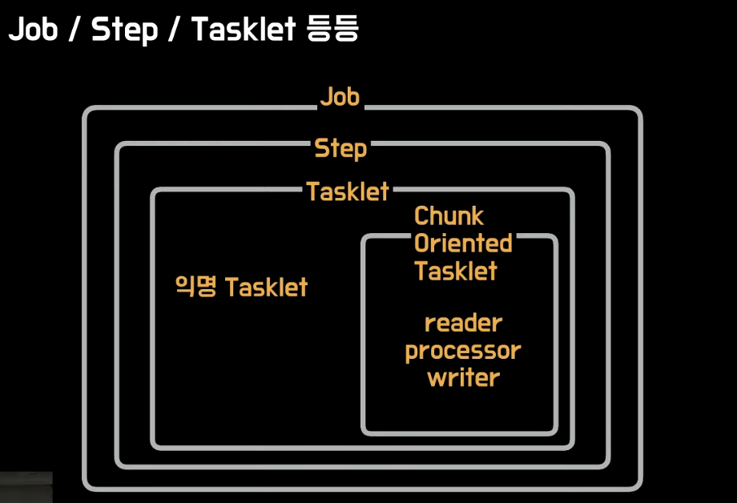
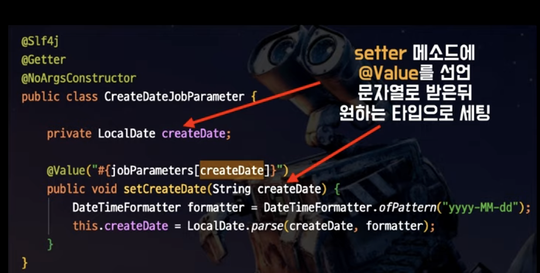
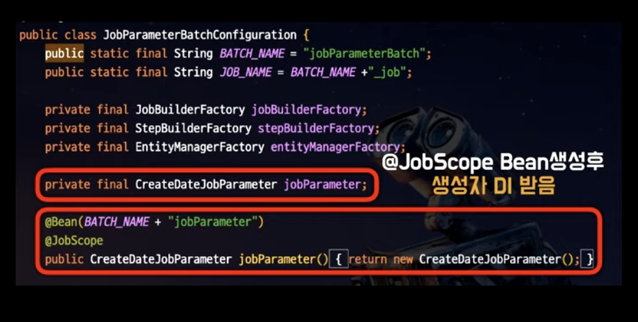

## 참고자료

- [우아한 테크 세미나](https://www.youtube.com/watch?v=_nkJkWVH-mo)

- [Spring Batch + Scheduler 구현해보기](https://dalgun.dev/blog/2019-10-30/spring-batch)
- [github.com/dalgun](https://github.com/dalgun/play)

<br>

## Spring Batch 란?

Batch 라는 것은 [위키](https://ko.wikipedia.org/wiki/%EC%9D%BC%EA%B4%84_%EC%B2%98%EB%A6%AC) 를 참고하면 최종사용자의 개입 없이 또는 실행을 스케쥴링 할 수 있는 작업(job)의 실행을 의미한다.<br>

위 세미나에서 언급하지는 않았지만, 개인적인 의견은 이렇다. <br>

**Batch** 는 어떤 프로그램에서든 어떤 프로그래머든 작성할 수 있는 코드다. <br>

**Spring Batch** 는 엑센츄어라는 유명한 회사에서 만든 배치에 대한 경험과 기술력으로 만든 배치 관련 라이브러리다. 앞에 스프링을 붙인 스프링 배치는 스프링에서 배치를 유지보수가 간편하도록 도와주는 하나의 라이브리리다.<br>

엑센추어는 미국주식으로도 등록되어 있다. 티커는 [ACN](https://www.google.com/search?rlz=1C5CHFA_enKR956KR956&q=NYSE:+ACN&stick=H4sIAAAAAAAAAONgecRoyi3w8sc9YSmdSWtOXmNU4-IKzsgvd80rySypFJLgYoOy-KR4uLj0c_UNzKuyKy3NeRaxcvpFBrtaKTg6-wEAH4ybEEYAAAA&sa=X&ved=2ahUKEwi-2Nzvl7XyAhXFMd4KHeSYDvIQsRUwHnoECEgQAw&biw=1715&bih=882&dpr=2) 이다.<br>

<br>

## 배치가 필요한 경우

대용량 데이터 처리가 필요할 때 배치 처리가 필요하다. 모든 데이터를 메모리에 쌓지 않고, 부분적으로 여러번 가져와 처리를 반복해 청크 사이즈 만큼 처리를 하고자 할때 스프링 배치를 사용하게 된다.

ex) 한달에 한번 쌓인 모든 데이터를 종합하여 데이터에 대한 연산이 필요한 경우<br>

<br>

## 스프링 배치가 필요한 경우

Spring Batch 가 필요한 경우들

- 일정시간마다 수행되어야하는 기능
- 기능 수행 중 문제가 발생했을 때 해당 지점부터 다시 시작하는 기능
- 같은 파라미터로 여러번 수행 요청이 발생했을 때, 단 한 번만 수행되어야 하는 경우

<br>

## 스프링 배치의 장점

- 대용량 데이터 처리에 최적화되어 있다.
- 로깅, 통계처리, 트랜잭션 관리 등의 재사용 가능한 필수 기능을 제공한다.
- 예외 상황, 비정상 동작에 대한 방어기능이 있다.
- 비즈니스 로직에 더 집중할 수 있다.


## Job,Step,Tasklet



<br>

tasklet 과 reader, processor, writer 는 따로 움직이는 것으로 착각하는 경우가 많다고 한다. <br>

하지만 직접 코드를 확인해보면, reader, writer, processor 는 ChunkOrientedTasklet 이라는 클래스 내에 구현되어 있다.

Tasklet 은 interface 이다. 그리고 ChunkOrientedTasklet 은 Tasklet을 구현한 하나의 클래스이다. <br>

Tasklet 을 implements 한 클래스는 여러가지가 있는데, 그 중 ChunkOrientedTasklet 은 Chunk 단위로 무언가를 읽어들일 때에 사용하는 Tasklet이다.<br>


## Scope


Step 의 Scope는 @JobScope 이다.<br>

Tasklet/Reader/Processor/Writer 의 Scope 는 @StepScope 이다.<br>

<br>

## Job Parameter

스프링 배치에서 Job Parameter에 사용가능한 데이터 타입들은 아래와 같다.

- Long
- STring
- Double
- Date

(Enum, LocalDate, LocalDateTime 은 지원되지 않는다.)

<br>

## LocalDateTime이 지원되지 않는 문제

LocalDateTime 이 지원되지 않는 문제. 매번 형변환을 해야 한다.

<br>

## @Setter 의존성 주입으로 커스터마이징

JobParameters 라는 인자값을 가져올 때 @Value 로 가져오게 되는데, 이때 문자열 기반의 날짜를 LocalDateTime 같은 타입으로 변환해야 할 경우 매번 같은 코드를 반복해야 하기에 실수의 여지가 있다.<br>

이렇게 @Value 로 String 파라미터를 주입받아서 LocalDateTime 으로 변환하는 작업은 의존성 주입을 하는 하나의 별도의 클래스를 만들어서 사용하면 간편하다. 예를 들면 JobParameter 중 날짜 값은 별도의 클래스에 생성자 주입을 해서 별도의 처리를하도록 하는 방식이다.<br>

이것을 대신 해줄 클래스인 CreateDateJobParameter 클래스를 하나 만들어준다. <br>

예를 들면 아래와 같은 방식이다.<br>



<br>

그리고 이렇게 생성한 클래스는 스프링 Bean으로 생성해서 애플리케이션 전역적으로 사용할 수 있도록 해준다.<br>



<br>

## @JobScope, @StepScope 빈의 생성시점

- @JobScope 는 Job 실행 시점에 Bean 을 생성시킨다는 것을 의미한다.

- @StepScope 는 Step 실행 시점에 Bean 을 생성시킨다는 것을 의미한다.

애플리케이션 실행 후에도 동적으로 reader/processor/writer 빈을 생성하는 것이 가능하다.

<br>

## JobParameter 동적생성

> 프로그램 내에서 런타임에 JobParameters 객체를 생성하는 법을 알아보자

### 1) Map<K,V> 를 JobParameter 객체 내에 바인딩해 세팅하는 방식

JobParameter 라는 이름의 객체 인스턴스 내에 Map<K,V> 를 전달해주는 방식이다.

```java
JobParameters: {
  Map<"파라미터명", JobParameter>
}
```

<br>

> 위에서 사용한 표현식은 어딘가에서 정해진 규칙이 아니고, 뭔가 Javascript 처럼 표현해보려고 하다가 조금 이상한 표현식이 생겨나긴 했다.<br>


명확히 해두어야 할것은 JobParameters 와 JobParameter 는 다르다. 철자 s 를 자세히 봐야 구별이 되어서 가끔 짜증날때도 있지만, 어쩔수 없다. 주의해서 봐야 한다.<br>

JobParameters 에는 Map<K, JobParameter> 를 넘겨줄 수 있다. 이것의 의미를 하나씩 나열해서 표현해보면 아래와 같다.

```plain
파라미터 명#1 : JobParameter #1
파라미터 명#2 : JobParameter #2
// ...
```

<br>

JobParameter를 만들어내는 구문을 예로 들어보면 이렇다.

```java
// Map<K, JobParameter> 의 쌍을 여러개 만들기
Map<String, JobParameter> **param** = new HashMap<>();
param.put("time", System.currentTimeMillies() );
param.put("vol" , new JobParameter(1L));

// param 을 JobParameters 에 넘겨주기
JobParameters params = new JobParameters( **param** );
```

<br>

### 2) JobParameterBuilder 를 이용해서 세팅하는 방식

```java
JobParameters jobParameters = new JobParametersBuilder()
	.addString("orderDate", orderDate.format(FORMATTER))
	.toJobParameters();

JobExecution jobExecution = jobLauncherTestUtils.launchJob(jobParameters);
```

<br>

## Job 을 프로그램 내부에서 런타임에 실행시켜 보기

런타임에 Job을 동적으로 생성하는 예는 아래와 같은 경우가 있을 것 같다.

- 쿼츠와 같은 스케쥴러에서 메일 발송 Job 등을 실행해야 할때
- RabbitMQ에서 전달된 메시지를 일정 사이즈만큼 캐시 버퍼에 모아두었다가 특정 시점에 Batch Job 으로 INSERT 하는 작업을 수행하고 싶을 때 

<br>

어렵다거나 그런 내용은 아니라서 최대한 요약한 방식으로 정리해보면 아래와 같다.<br>

> 참고) JobParameters 객체를 생성하는 두가지 방법(Map vs빌더)은 위에 정리되어 있다.

```java
@Autowired
private JobLauncher jobLauncher;

// ...

@Scheduled(initialDelay = 10000, fixedDelay = 30000)
public void runJob(){
	// ... 파라미터 세팅
	
	try{
		jobLauncher.run(jobConfiguration.job(), jobParameters);
	}
	// ...
}
```

<br>

ex)

```java
@Slf4j
@Component
public class JobScheduler {
    @Autowired
    private JobLauncher jobLauncher;

    @Autowired
    private JobConfiguration jobConfiguration;

    @Scheduled(initialDelay = 10000, fixedDelay = 30000)
    public void runJob() {

        Map<String, JobParameter> confMap = new HashMap<>();
        confMap.put("time", new JobParameter(System.currentTimeMillis()));
        JobParameters jobParameters = new JobParameters(confMap);

        try {

            jobLauncher.run(jobConfiguration.job(), jobParameters);

        } catch (JobExecutionAlreadyRunningException | JobInstanceAlreadyCompleteException
                | JobParametersInvalidException | org.springframework.batch.core.repository.JobRestartException e) {

            log.error(e.getMessage());
        }
    }
}
```

<br>

## Job, Step, Reader, Processor, Writer 의 개념


## Step, Reader,Processor, Writer 예제모음

### 1) 구구단

### 2) 뭐할까?


